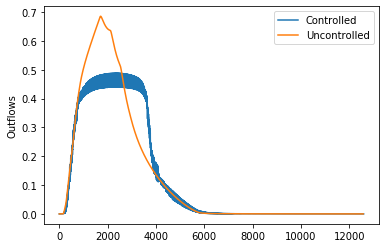

Scenario Theta
==============

This scenario was created to serve as a unit test for control algorithms.
In this scenario, two idealized basins (in parallel) of :math:`1000m^3` are draining into a downstream water body. 
Outlets in the basins (:math:`1m^2`) are at the bottom and can be controlled throughout the duration of the simulation.

.. image:: ./figures/theta.png
  :width: 400
  :align: center

Objective
---------

Maintain the flow of water at the outlet of the stormwater network below :math:`0.5 m^3s^{-1}`.
The degree of success or failure of the algorithm to achieve the objective is computed based on the following metric.

States
------

Water levels (:math:`m`) in the two basins at every step, indexed by the order of the basin are
defined as the states in this scenario.

Control actions
---------------

Percent of valve opening :math:`[0,1]` at the outlet of each basin.

Example: Equal-filling Controller
---------------------------------
.. code:: ipython3

    import pystorms
    import numpy as np
    import matplotlib.pyplot as plt
    %matplotlib notebook

.. code:: ipython3

    env = pystorms.scenarios.theta()
    done = False
    while not done:
        done = env.step(np.ones(2))
    print("Uncontrolled Performance : {}".format(env.performance()))

.. parsed-literal::

    Uncontrolled Performance : 0.1296391721430919

**Lets take a look at the network outflows in the uncontrolled
response**

.. code:: ipython3

    plt.plot(env.data_log["flow"]["8"])
    plt.ylabel("Outflows")

.. parsed-literal::

    Text(0, 0.5, 'Outflows')

.. image:: figures/theta_uncontrolled.png

Now, lets see if we can design a control algorithm to maintain the
flows below :math:`0.5 m^3s^{-1}`

Design of such a control algorithm can be approached in many ways. But
the fundemental idea behind any of these algorithms would be to hold
back water in the basins and coordinate the actions of these basin such
that their cummulative outflows are below the desired threshold. In this
example, we will design a simple algorithm that achives this.

.. code:: ipython3

    def controller(state, target, MAX=2.0):
        fd = state / MAX
        avg_fd = np.mean(fd)
        potential = fd - avg_fd  # [<0, 0, <1]
    
        for i in range(0, 2):
            if potential[i] < -0.001:
                potential[i] = 0.0
            elif potential[i] < 0.001 and potential[i] > -0.001:
                potential[i] = avg_fd
    
        if sum(potential) > 0.0:
            potential = potential / sum(potential)
    
        actions = np.zeros(2)
        if state[0] > 0.00:
            flow0 = target * potential[0]
            actions[0] = min(1.0, flow0 / (1.00 * np.sqrt(2.0 * 9.81 * state[0])))
        if state[1] > 0.00:
            flow1 = target * potential[1]
            actions[1] = min(1.0, flow1 / (1.00 * np.sqrt(2.0 * 9.81 * state[1])))
        return actions

.. code:: ipython3

    env_controlled = pystorms.scenarios.theta()
    done = False 
    while not done:
        state = env_controlled.state()
        actions = controller(state, 0.50)
        done = env_controlled.step(actions)

.. code:: ipython3

    plt.plot(env_controlled.data_log["flow"]["8"], label="Controlled")
    plt.plot(env.data_log["flow"]["8"], label="Uncontrolled")
    plt.ylabel("Outflows")
    plt.legend()

.. code:: ipython3

    print("Controlled performance: {} \nUncontrolled performance: {}".format(env_controlled.performance(), env.performance()))

.. parsed-literal::

    Controlled performance: 0.0 
    Uncontrolled performance: 0.1296391721430919

Controller is able to maintain the outflows from the network below the desried threshold.
