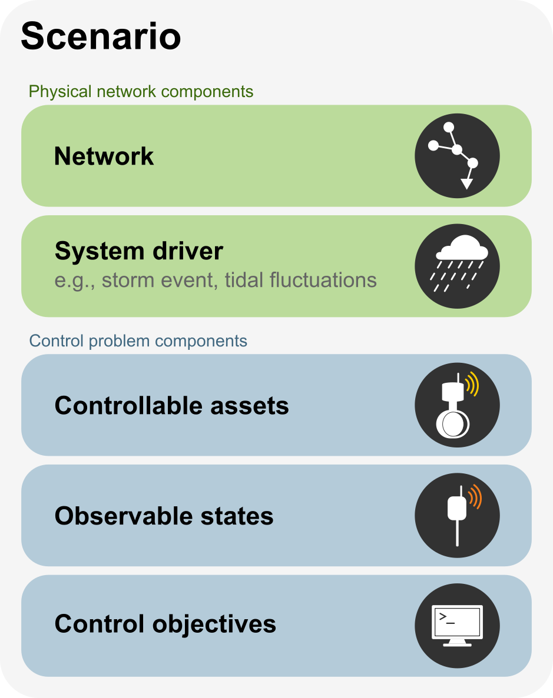

=========
Scenarios
=========

Scenarios are the primary components of the ``pystorms`` library. These scenarios comprise of a stormwater network, system driver, and corresponding control problem. This library provides a set of standardized scenarios that can be used for the evaluation and development of control algorithms. Apart from these predefined scenarios, users have the choice to mix and match stormwater networks with any of the stormevents provided in the library.

List of scenarios 
=================

1. Scenario theta 
2. Scenario alpha (development) 
3. Scenario beta (development)
4. Scenario gamma 
5. Scenario delta (development)
6. Scenario epsilon

Observable States
-----------------
Each of these scenarios are defined with a initial set of states that you can use for developing your control algorithms. But these set of states (i.e. depth and water levels in various elements of the stormwater network) are not the only measurements you can access. You can access to all the measurements computed by the stormwater simulation engine. Default state vector in each scenario is supposed to represent our best estimate of the measurements that can be used for making real-time control decisions in a stormwater network. Currently, as of yet, there isn't a methodology for selecting a "ideal" state vector for making real-time control decisions. Hence, we encourage the users explore other state definitions, as there might exist an other set of states that are better suited for a controlling a stormwater network.   
